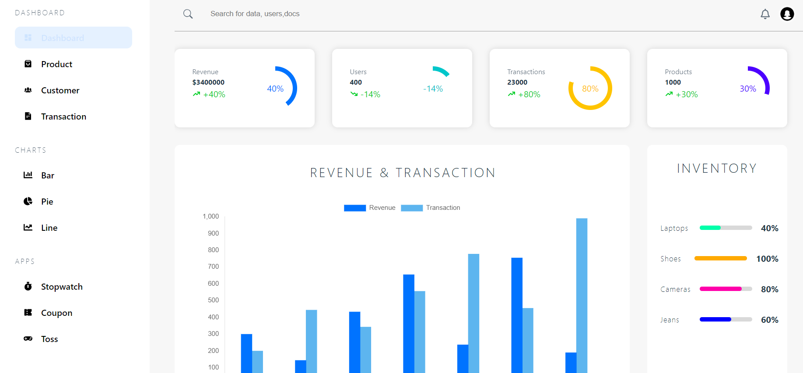
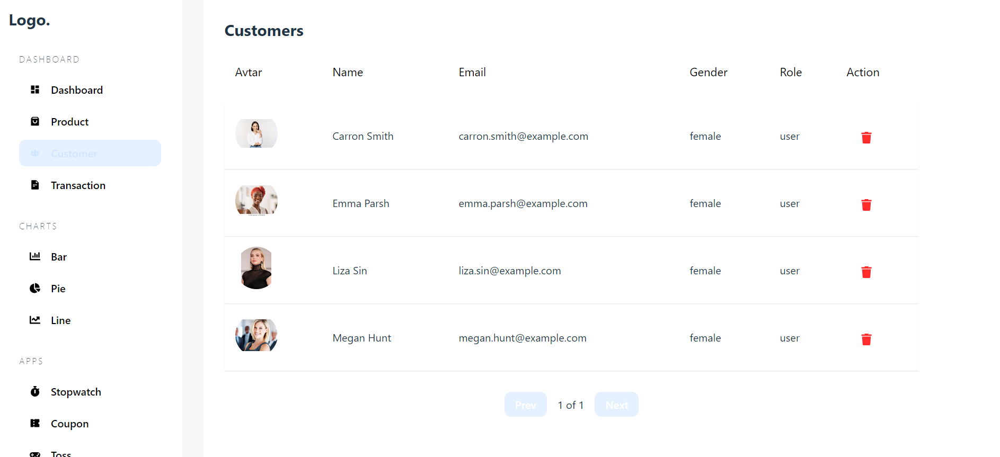
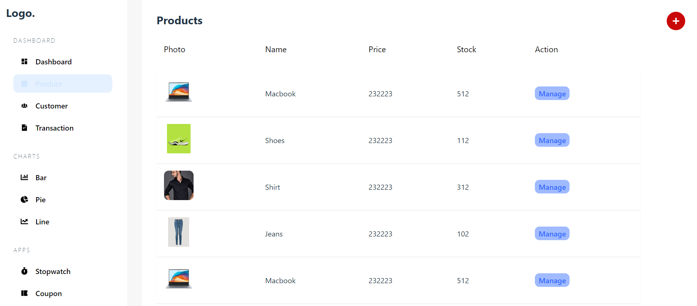
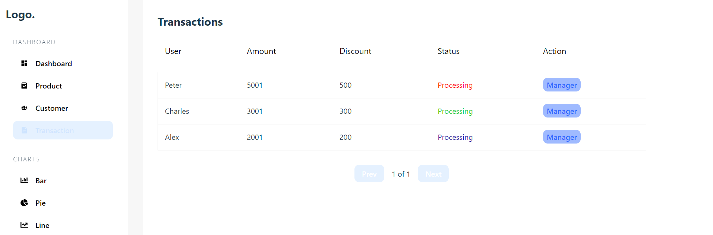

## <p align="center">Admin-dashboard</p>


## <p align="center"> React + TypeScript + Vite + SCSS</p>

This template provides a minimal setup to get React working in Vite with HMR and some ESLint rules.

<p align="center">
  <a href="https://admin-dashboard-phi-sand.vercel.app/">View Admin-dashboard</a></p>


## 🌍 Features
- React
- TypeScript
- Vite
- SCSS
- React-router-dom
- React-icons
- React-chartjs-2

## 🚀 Screeenshots







## 🤝 Acknowledgements
I would like to express my expirienced of this project was a great learning experience for me. Usinng React, TypeScript, and Vite, I was able to create a dynamic and responsive admin dashboard that met the requirements of the project.


## 📝 Component Reusability:
I have implemented component reusability in this project by creating reusable components such as Navbar, Sidebar, and Footer. This approach not only reduces code duplication but also makes the codebase more maintainable and easier to update.

## 🚩 Conclusion
In conclusion, this project adheres to the admindashboard of ecomerce website. I used react table, chakra-ui, react-router-dom, react-icons, react-chartjs-2, and added apps.json file to store the data.

## ➡️ Installation of React + Vite + SCSS 
1. Clone the repository:
```bash
git clone https://github.com/kirangadhavi/admin_dashboard.git
```
2. Navigate to the project directory:
```bash
cd admin_dashboard
```
3. Install the dependencies:
```bash
npm install
```
4. Start the development server:
```bash
npm run dev
```
5. Open your browser and visit [https://admin-dashboard-phi-sand.vercel.app/]to see the project.


